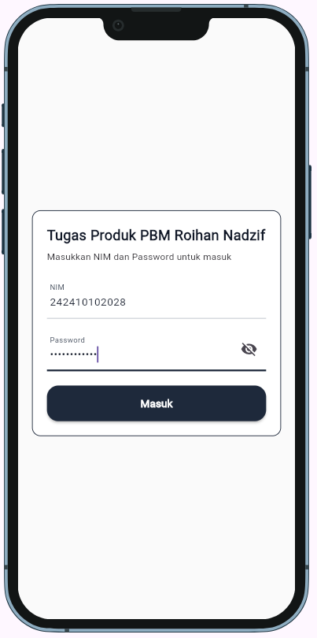
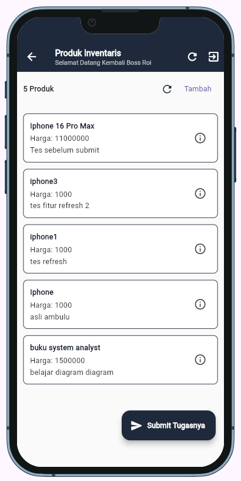
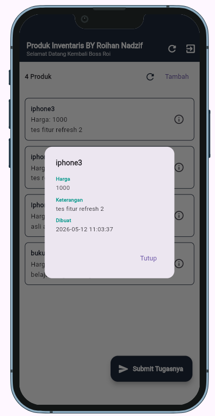
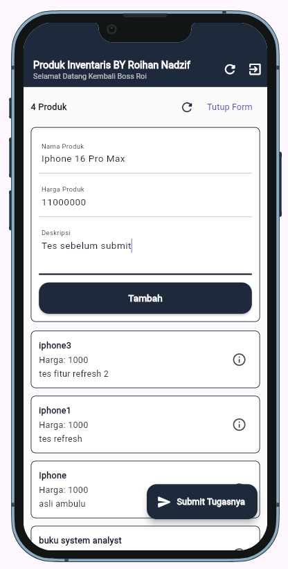
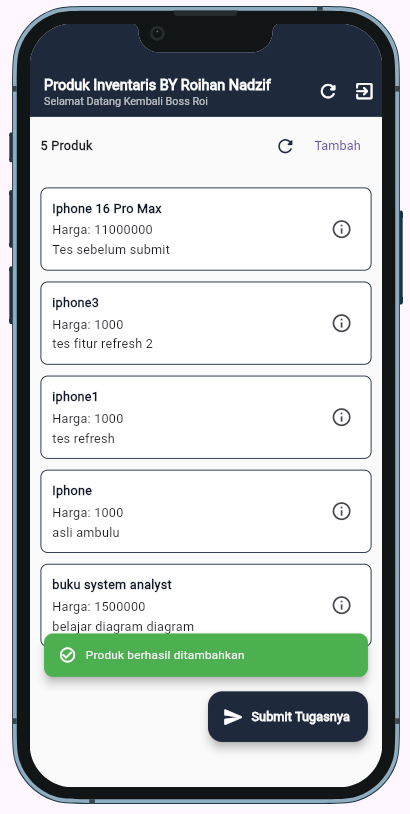
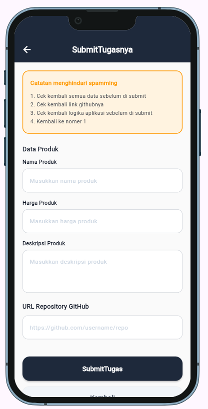
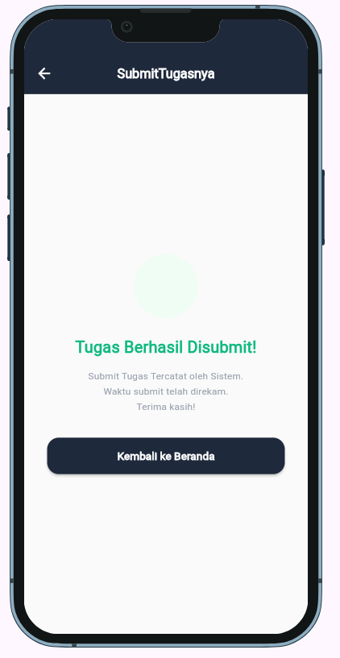
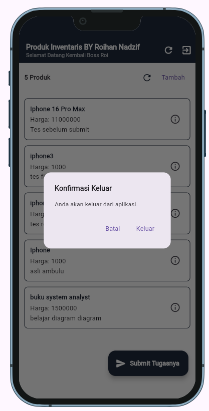

## 📸 Tampilan Aplikasi (Screenshot)

<p align="center">
  
  <br><i>Halaman Login</i>
</p>

<p align="center">
  
  <br><i>Halaman Utama</i>
</p>

<p align="center">
  
  <br><i>Detail Produk</i>
</p>

<p align="center">
  
  <br><i>Form Tambah Produk</i>
</p>

<p align="center">
  
  <br><i>Tambah Produk Berhasil</i>
</p>

<p align="center">
  
  <br><i>Form Submit Tugas</i>
</p>

<p align="center">
  
  <br><i>Submit Tugas Berhasil</i>
</p>

<p align="center">
  
  <br><i>Halaman Logout</i>
</p>

## 📁 Struktur Project

```
lib/
├── main.dart                              # Entry point & pengecek sesi
├── models/
│   ├── user_model.dart                    # Model data Pengguna
│   ├── produk_detail_model.dart           # Model data Produk Detail
│   └── hasil_autentikasi_model.dart       # Model response autentikasi
├── services/
│   ├── auth_services.dart                 # Layanan login API
│   ├── produk_services.dart               # Layanan produk & submit tugas
│   └── token_vault.dart                   # Penyimpanan token (Secure Storage)
├── screens/
│   ├── cek_login.dart                     # Logika pengecekan status login
│   ├── page_login.dart                    # UI Halaman Katalog & Login
│   └── page_submittugas.dart              # UI Halaman Submit Tugas
├── widgets/
│   ├── card_produk.dart                   # Komponen kartu produk
│   ├── info_produk.dart                   # Komponen tombol & info produk
│   └── input_button.dart                  # Komponen input kustom
├── provider/
│   ├── auth_provider.dart                 # State management autentikasi
│   ├── product_provider.dart              # State management produk
│   └── submit_provider.dart               # State management submit tugas
└── config/
    └── konfigurasi_app.dart               # Konfigurasi URL API & Tema
```

---
*Dibuat oleh: Roihan Nadzif*
*Nim : 242410102028*
